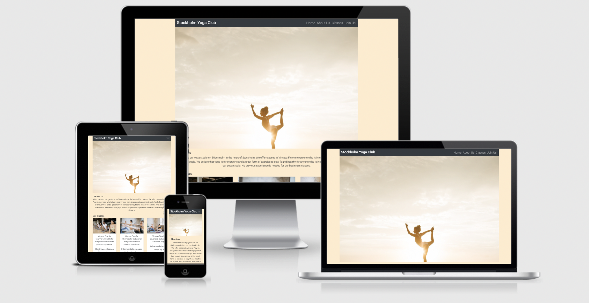

# Stockholm Yoga Club

For my Milestone Project 1 on Code Institute's Diploma in Software Developement course I have created a yoga studio website. Stockholm yoga club is a yoga studio based in Stockholm, Sweden.

For link to the website click [Here](https://sabinastorm.github.io/yoga-club)

Design has been focused to Responsive.

## Who is this website for?

This is a yoga studio website that offers classes in Vinyasa Flow. It is designed and created for a yoga studio to show classes and location of the studio to attract new customers. It is also designed and created for people who live in or near Stockholm, Sweden to find the studio and information about what it can offer and sign up for classes.

## The owner

The owner of this site is Stockholm Yoga Club

## What does it do?

The website connects people who are looking for a yoga studio with Stockholm yoga club. Where they can easily find information about the studio, what classes it has to offer. What days and times the classes are and the location of the studio.

## User experience

### User stories

#### From customers perspective

- As a user I want to navigate clearly and logically through the website

- As a user I want to easily see what classes the studio has to offers
- As a user I want to learn more about the company
- As a user I want to easily find the location of the company
- As a user I want to know how to contact the company
- As a user I want it to be simple to sign up to classes

#### Customers perspective fulfilment

- Navigation, Foooter and the pages content are layed out in a clear and logical way to guide user to the desired location
- Navigation bar has a direct link to Our classes
- The website has a section with information about the company 
- Footer has address 
- The footer has a contact us and social media links 
- The join us section makes it easy for customers to sign up for classes

## UX 5 Planes
### Strategy Plane
The website is created to recruit new customers to the yoga studio. Page is created in a very simple, yet effective way to serve it's purpose. The information is clear and calls to action point in the right direction.

Main aims are to inform of the companys existment.

### Scope Plane
Features included in this Project

- One page 
- navigationbar to direct to different sections of the page
- one form for sign up
- footer with contact information

### Structure plane
Website consists of one page with the specific purpouse. The page is laid out logicaly, so the user can easily find their way around it.

- Navigation 
Navigation helps the user navigate through the page and through it's content. Navigation on smaller screens is compressed in a button, which on click drops down all the menu items. 

- Home 
The home page features a hero image.

- About us section
This section has a short description of what the company is about.

- Join us
This section consists of a short heading followed by the general sign up form and selection of classes.

- Footer 
consists of 2 columns. First column consists of the address to the yoga studio. The second column consists of social icons which opens the desired social network in a new tab.

### Skeleton Plane
Design was focused towards mobile and big screen as well.

### Surface Plane
- Colors

For navigation and footer backgroud the color used is darkgrey

Color of some fonts and the color of links and buttons on hover is #ffebcd and 

Background Color of entire website is #ffebcd/ blanchalmond

- Typography

Throughout the website two font families are used

Roboto 

Sans-serif

Fonts are obtained from Google Fonts.

## Features
### Exsisting Features
created in HTML5, CSS3 and Bootstrap
- navigation bar
- table of classes
- social media links
- sign up form

### Feature for future implementation
- gallery page
- form for message
- Google map to show exact position of the studio 
- fixed header

## Technologies used

- [HTML5](https://en.wikipedia.org/wiki/HTML) for markup
- [CSS3](https://en.wikipedia.org/wiki/CSS) for style
- [Google Fonts](https://fonts.google.com/) for fonts
- [Bootstrap](https://getbootstrap.com/) for main frame, tables and form of the website
- [Font Awesome](https://fontawesome.com/) for icons
- [Git](https://gitpod.io/) for version control
- [GitHub](https://github.com/) for keeping the files, documents and deployment of the website

## Resources

- [Pexels](https://www.pexels.com/) for images with free license
- [Code Institute](https://learn.codeinstitute.net/) course materials
- [Code Institute](https://learn.codeinstitute.net/) Slack Community
- [Stackoverflow](https://stackoverflow.com/)
- [W3schools](https://www.w3schools.com/)
- [Am I Responsive](http://ami.responsivedesign.is/) for a responisve image in Read Me
- [5pence](https://5pence.net/) for markdown

## Testing

### Browser testing

### Validators

The website has been through W3C Jigsaw validation with 5 errors.

- var(--fa-animation-delay, 0) är inte ett animation-delay-värde : var(--fa-animation-delay, 0)

- var(--fa-animation-delay, 0) är inte ett animation-delay-värde - var(--fa-animation-delay, 0)
- var(--fa-animation-delay, 0) är inte ett animation-delay-värde - var(--fa-animation-delay, 0)
- var(--fa-animation-delay, 0) är inte ett animation-delay-värde - var(--fa-animation-delay, 0)
- var(--fa-rotate-angle, none) är inte ett transform-värde : rotate(var(--fa-rotate-angle, none))

The errors are in bootstrap and I have no control over it.

Website has been through W3C HTML Validator and there is one error to report

- Error: script element between head and body

### Local testing

Testing of all the buttons, links and function of the form of the website has been carried out. There was few links which needed to be fixed and that was done. When pressing the Home link it didn't work. The anchor element was missing. It is now fixed.

While testing the form I discovered that all the fields are not being correctly required. That has been fixed by renameing the for value in label.

### Responsiveness

I used Google Chrome Dev Tools to check the responsiveness of website. No errors found.

## Version control

### Git and Github

I used GitPod as a local repository and GitHub as a remote repository. The process of version control was:

- First i created a new repository in GitHub
- Then opened that repository in GitPod and started coding
- In GitPod i created my files and folders
- I then saved my work and pushed it to GitHub repository to keep it safe

Saving, commiting and pushing it to remote repository in terminal:
- git add . 
- git commit -m "Commit message" 
- git push to update work to GitHub

## Deployment

To deploy the website, I followed the below steps on [GitHub](https://github.com/).

- Go to "Settings" on the repository
- On "Source" of "GitHub Pages", select "master for Branch and click save
- Refresh page
- The website is now published on GitHub Pages and the link is provided on on the same section

